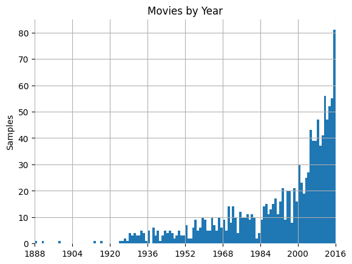
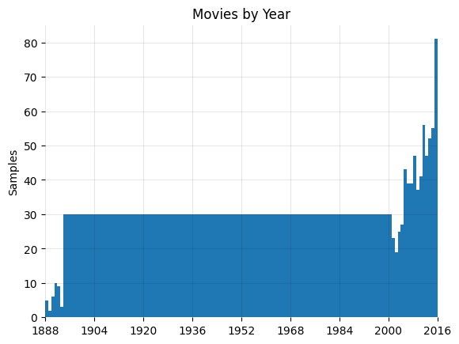

# imdb-movies
Simple architecture consisting of the base of the VGG16 pre-trained model, which produces embeddings of the input image (movie poster), followed by a fully-connected head which performs regression and estimates the year of the input movie.

## Part 1. Create embedding
Use a pre-trained model, VGG16, to create a flat (ie 1D) embedding vector of some size `embedding_size` for each movie poster, and put all of these together into a single tensor of shape `(n_movies, embedding_size)`.

## Part 2. Define a nearest-neighbour function
Write a function `def nearest(img, k)` which accepts an image `img`, and returns the `k` movies in the dataset whose posters are most similar to `img` (as measured in the embedding), ranked by cosine similarity.

## Part 3. Demonstrate your nearest-neighbour function
Choose any movie poster. Call this the query poster. Show it, and use the nearest-neighbour function to show the 3 nearest neighbours (excluding the query itself).

## Part 4. Year regression
Investigate the last question ("similar era") above by running regression on the year, ie attempt to predict the year, given the poster. Use a train-test split. Build a suitable Keras neural network model for this, as a regression head on top of the embedding from Part 1. Include comments to explain the purpose of each part of the model. It should be possible to make a prediction, given a new poster (not part of the original dataset).

## Part 5. Improvements

I made an observation that the years of all movies from the dataset are in the range between 1888-2016
(with some gaps). I wanted to check the distribution so I plotted the following histogram:

Based on that, we can clearly see that the majority of years are very underrepresented in the dataset. In fact, only the most recent years have a reasonable number of samples. This makes for an extremely unbalanced dataset, meaning that any regression model might struggle in predicticting years that are underrepresented.

That is why I have decided to balance the dataset a little by scraping more data from IMDB. Based on looking at the histogram I have assumed that all samples preceeding the year 2000 are underrepresented so that is why I have decided to rebalance that part of the dataset. Then I have set a threshold t which I have set to 30. I then calculate the difference between that and the number of samples for each year which gives me the number of new samples that I need to add.

That way we can both increase the total number of training case and also guarantee that each year is represented by at least t samples in the dataset. Of course, the higher t is the better performance we can achieve, but for the purpose of this project I have decided to keep t at 30 because scraping data takes a lot of computational time.

I then scraped the corresponding number of movies per year. A total of 2638 new movies have been fetched. We end up with a dataset of 3452 movie posters. The initial dataset has been increased by a considerable amount from 1254 samples to 3452 which is almost 3 times bigger and will hopefully allow us to achieve far better generalisation on the data.

Now, we can see that the majority of the years are decently represented by 30 movies each.
